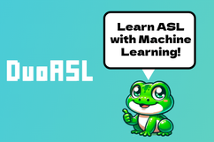

# DuoASL - nwHacks 2024 1st Place in Health and Accessibility - Gamify Learning ASL with Machine Learning!

Made by: Jason Zhao, Aftahi Ardi, Arnav Prasad, Ram Jayakumar 

[Check out the devpost here!](https://devpost.com/software/duoasl)

## Inspiration

As someone who has always wanted to speak in ASL (American Sign Language), I have always struggled with practicing my gestures, as I, unfortunately, don't know any ASL speakers to try and have a conversation with. Learning ASL is an amazing way to foster an inclusive community, for those who are hearing impaired or deaf. DuoASL is the solution for practicing ASL for those who want to verify their correctness!

## What it does

DuoASL is a learning app, where users can sign in to their respective accounts, and learn/practice their ASL gestures through a series of levels. 

Each level has a _"Learn"_ section, with a short video on how to do the gesture (ie 'hello', 'goodbye'), and a _"Practice"_ section, where the user can use their camera to record themselves performing the gesture. This recording is sent to the backend server, where it is validated with our Action Recognition neural network to determine if you did the gesture correctly!

## How we built it

DuoASL is built up of two separate components;

**Frontend** - The Frontend was built using Next.js (React framework), Tailwind and Typescript. It handles the entire UI, as well as video collection during the _"Learn"_ Section, which it uploads to the backend

**Backend** - The Backend was built using Flask, Python, Jupyter Notebook and TensorFlow. It is run as a Flask server that communicates with the front end and stores the uploaded video. Once a video has been uploaded, the server runs the Jupyter Notebook containing the Action Recognition neural network, which uses OpenCV and Tensorflow to apply the model to the video and determine the most prevalent ASL gesture. It saves this output to an array, which the Flask server reads and responds to the front end.

## Challenges we ran into

As this was our first time using a neural network and computer vision, it took a lot of trial and error to determine which actions should be detected using OpenCV, and how the landmarks from the MediaPipe Holistic (which was used to track the hands and face) should be converted into formatted data for the TensorFlow model. We, unfortunately, ran into a very specific and undocumented bug with using Python to run Jupyter Notebooks that import Tensorflow, specifically on M1 Macs. I spent a short amount of time (6 hours :) ) trying to fix it before giving up and switching the system to a different computer.

## Accomplishments that we're proud of

We are proud of how quickly we were able to get most components of the project working, especially the frontend Next.js web app and the backend Flask server. The neural network and computer vision setup was pretty quickly finished too (excluding the bugs), especially considering how for many of us this was our first time even using machine learning on a project!

## What we learned

We learned how to integrate a Next.js web app with a backend Flask server to upload video files through HTTP requests. We also learned how to use OpenCV and MediaPipe Holistic to track a person's face, hands, and pose through a camera feed. Finally, we learned how to collect videos and convert them into data to train and apply an Action Detection network built using TensorFlow

## What's next for DuoASL

We would like to:
- Integrate video feedback, that provides detailed steps on how to improve (using an LLM?)
- Add more words to our model!
- Create a practice section that lets you form sentences!
- Integrate full mobile support with a PWA!
